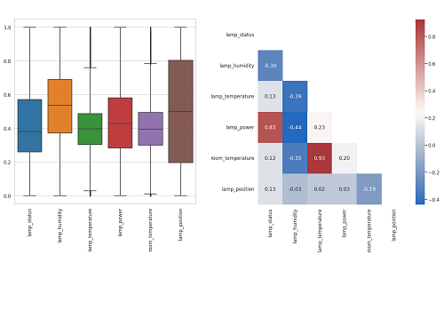

# Calibrate temperature and humidity readings of lamp sensor

 

#### -- Project Status: [Completed]

## Project Intro/Objective
The purpose of this group project is to calibrate the readings from lamp sensors to compensate for the internal heat generated by the lamps so that the sensor readings reflect the actual room temperature and humidity.

### Team Members
* Anita Gaj
* Avinash Chekuru
* Ling Yee Khor

### Methods Used
* Data Visualization
* Multiple Linear Regression
* Random Forest
* Machine Learning (Supervised)
* Machine Learning (Unsupervised)

### Technologies
* Python
* Streamlit
* Pandas
* Scikit-learn
* Statsmodels
* Matplotlib
* Seaborn
* Visual Studio Code

## Project Description
Temperature and humidity readings from lamp sensors are inaccurate due to the internal heat generated by the lamps themselves. This group project aims to correct for that bias so that the lamp sensors can display the accurate temperature and humidity measures. Unsupervised machine learning is used to examine irregularities in the readings between lamps and across different time periods. Regression analysis and supervised machine learning are then used to predict the actual room temperature and humidity based on the biased readings of the lamp sensors. The final model has a mean absolute error of 0.48 degree Celsius in temperature with an R2-score of 0.83 and a mean absolute error of 1.11 percent in humidity with an R2-score of 0.97.  Using the final model, a streamlit app is built to predict the actual room temperature and humidity based on the readings captured by the lamp sensors. The app can predict the actual measures individually with manual input of lamp sensor readings or in batches by uploading a CSV file with lamp sensor readings from multiple lamps.